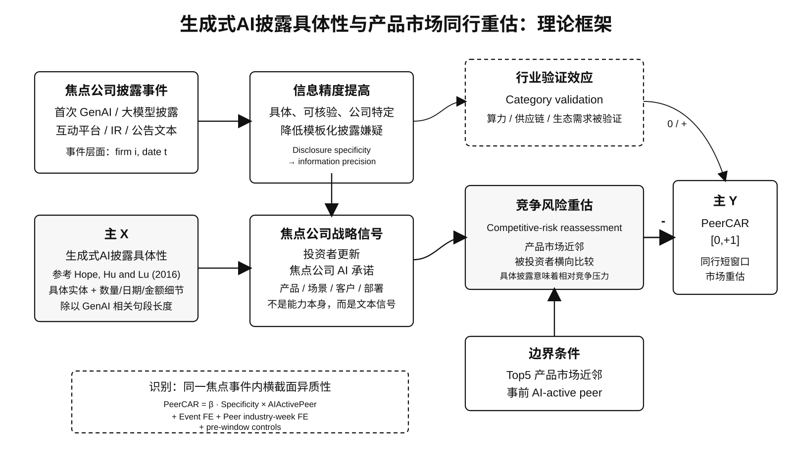

# T05 实验设计 v11：理论框架版

日期：2026-05-29

用途：统一当前论文主线、X/Y 测度、识别解释和理论框架图。本版保留可写的主效应设计，不再把新构造的严格 `genai_concreteness_*` 指标作为 headline X。



## 1. 当前主问题

本文研究：

```text
中国上市公司更具体的 GenAI / 大模型 / AIGC 披露，
是否会使资本市场对 AI-active 的近产品市场同行进行更负面的短窗口相对重估？
```

最安全的论文定位是：

```text
capital-market peer revaluation paper
```

不是：

```text
strong causal paper
realized business-stealing paper
real GenAI capability paper
```

## 2. 核心故事

GenAI 披露对同行有两个方向相反的含义。

第一是 **行业验证效应**。如果披露内容主要是算力、供应链、生态、AI 产业需求或行业景气，市场可能把它理解为整个 AI 赛道被验证。这种情况下，同行可能不跌，甚至可能上涨。

第二是 **竞争风险重估**。如果焦点公司披露了更具体的 GenAI 产品、应用场景、部署进度、客户方向、合作方、商业化路径或模型能力，市场更可能把它视为一个可信的产品市场竞争信号。这个信号对普通同行未必重要，但会影响已经处于 AI 竞争空间、并且与焦点公司产品市场接近的同行。

因此本文的核心不是“GenAI 披露让所有同行下跌”，而是：

```text
更具体的焦点 GenAI 披露
  -> 信息精度更高、boilerplate / hype 嫌疑更低
  -> 投资者更容易把它理解为焦点公司的可信竞争信号
  -> AI-active 的近产品市场同行被相对负面重估
```

## 3. 文献锚点

### 3.1 X：披露具体性

本文把 `Specificity_z` 解释为：

```text
生成式 AI 披露具体性 / GenAI disclosure specificity
```

含义是投资者在披露日可观察到的文本细节密度，而不是真实 GenAI 能力、真实投资或真实商业化成功。

测度思想参考 **Hope, Hu and Lu (2016, Review of Accounting Studies)**。该文把 qualitative disclosure specificity 理解为披露文本中具体、公司特定、可核验的信息密度，并用具体实体和数量细节相对披露长度来刻画。

本文迁移到 GenAI 场景：

```text
Specificity_e
  = 100 × GenAI related concrete details_e / GenAI related text length_e
```

其中 concrete details 包括日期、金额、百分比、数量、专名、组织 / 合作方、项目阶段等文本细节。主回归使用 winsorized / standardized 后的：

```text
Specificity_z_e
```

边界：

```text
可以说：生成式 AI 披露更具体、更有细节、更可核验。
不要说：公司真实 AI 能力更强、真实落地更多。
```

**Cheng, De Franco, Jiang and Lin (2019, Management Science)** 可以作为相邻文献，用来说明技术热点披露需要区分 speculative / generic talk 与 existing / substantive technology disclosure。但目前 headline X 不是直接复制 Cheng 的二分类，而是以 Hope 类 disclosure specificity 为主。

### 3.2 Y：同行短窗口市场重估

主 Y 是：

```text
PeerCAR[0,+1]
```

定义：产品市场同行 `j` 在焦点公司 GenAI 披露日 `t` 到下一交易日 `t+1` 的 market-model cumulative abnormal return。

这是 signed CAR，不是 `ln(1+Y)`，也不是 `|CAR|`。

原因：

```text
竞争风险机制有方向预测：AI-active close peers 应更负。
|CAR| 只适合信息含量，不适合本文的负向重估假设。
```

文献支撑：

- 短窗口市场反应 / 事件研究：Beaver (1968), MacKinlay (1997), Kothari and Warner (2007)。
- 同行信息转移和竞争效应：Foster (1981), Lang and Stulz (1992)。
- 产品市场同行识别逻辑：Hoberg and Phillips (2016) 的 text-based product market / TNIC 思路。

### 3.3 调节条件：AI-active close product-market peers

主调节变量：

```text
AIActivePeer_{j,t-5}
```

headline 定义：

```text
ext_any =
    prior CAC GenAI filing
 OR prior broad-AI patent grant
 OR prior broad-AI hiring in the previous 365 days
```

所有组件必须在焦点披露日前至少 5 天可观察，避免 look-ahead。

解释边界：

```text
ext_any 是事件前外部 AI 活动证据，不是精确 GenAI 能力测度。
```

稳健性定义：

```text
current_text_history =
    peer firm had prior GenAI disclosure before event date t-5
```

`current_text_history` 更贴近 GenAI 披露历史，但存在更明显的 pre-window negative pattern，因此不建议作为唯一 headline。

## 4. 主样本

观察单位：

```text
focal GenAI disclosure event e × product-market peer firm j
```

主样本：

```text
每家焦点公司首次 GenAI 披露事件 × Top5 产品市场同行
```

当前冻结口径：

```text
Rows: 7,805
Events: 2,177
Focal firms: 2,177
Peer firms: 3,345
Window: 2023-01-01 to 2026-05-20
Announcement-cleaned: yes
Requires PeerCAR[-10,-2] and PeerCAR[-20,-2]: yes
Requires FocalCAR[0,+1]: yes
```

## 5. 基准模型

主规格：

```text
PeerCAR_{e,j,[0,+1]}
  = beta_1 AIActivePeer_{j,t-5}
  + beta_2 Specificity_z_e × AIActivePeer_{j,t-5}
  + theta_1 PeerCAR_{j,[-10,-2]}
  + theta_2 PeerCAR_{j,[-20,-2]}
  + EventFE_e
  + PeerIndustryWeekFE_{j,t}
  + epsilon_{e,j}
```

推断：

```text
Two-way clustered standard errors by event_id and peer_code
```

核心系数：

```text
beta_2
```

解释：

```text
同一个焦点披露事件内，
AI-active peers 相对 non-AI-active peers 的短窗口 CAR 差异，
是否随着焦点披露 Specificity_z 更高而更负。
```

`EventFE` 吸收焦点事件层面的全部平均冲击，包括焦点公司新闻、披露日市场环境、焦点披露本身的平均效应，以及 `Specificity_z` 的事件层面主效应。

`PeerIndustryWeekFE` 吸收同一周同一同行行业的市场波动。

`PeerCAR[-10,-2]` 和 `PeerCAR[-20,-2]` 控制同行事件前趋势。

本文识别不是 DID，也不是 IV。最安全表述是：

```text
short-window peer-side market reassessment conditional on focal GenAI disclosure
```

## 6. 假设

### H1：条件性同行重估

更具体的焦点 GenAI 披露，与 AI-active 的 Top5 产品市场同行更负的 `PeerCAR[0,+1]` 相关。

### H2：产品市场接近度梯度

负向重估应集中在最接近的产品市场同行。Top1-3 应强于 Top6-10；低相似同行和随机同业不应复现该结果。

### H3：外部 AI 活动证据

该结果不应只依赖历史披露文本定义的 AIActive。用事件前外部 AI 活动证据 `ext_any` 定义 AIActive，也应得到同方向结果。

### H4：行业验证边界

AI 供应链、算力、数据中心、生态合作或需求验证类披露，不应产生同样的 `Specificity_z × AIActivePeer` 负向重估。它们更可能对应 category validation。

## 7. 当前证据摘要

### 7.1 Headline result

在 Top5 / first focal GenAI event / announcement-cleaned / `PeerCAR[0,+1]` / event FE + peer industry-week FE / pre-window controls / two-way clustering 下：

```text
ext_any:
Specificity_z × AIActivePeer = -0.002303, p = 0.020

current_text_history:
Specificity_z × AIActivePeer = -0.002275, p = 0.027
```

经济含义：焦点披露具体性增加 1 个标准差时，AI-active 近产品市场同行相对 non-AI-active 同行的两日异常收益低约 23 bps。

### 7.2 焦点公司自身利好与 pretrend

加入：

```text
FocalCAR[0,+1]
FocalCAR[0,+1] × AIActivePeer
PeerCAR[-10,-2]
PeerCAR[-20,-2]
```

后，核心系数基本不变。

这说明当前结果不太像简单由焦点公司自身利好程度或同行短期 pretrend 机械驱动。

### 7.3 产品市场有效性

目前最有力的支持证据是产品市场距离梯度：

```text
Top1-3: stronger negative effect
Top6-10: weak / insignificant
low-similarity peers: near zero
random same-industry non-Top10 peers: cannot reproduce Top5 result
AI-word-stripped similarity: result remains
```

这组证据是本文从“行业 AI 共振”走向“产品市场竞争风险”的关键。

### 7.4 新严格 X 的处理

2026-05-28 构造的 `genai_concreteness_z` / `genai_concreteness_resid_z` 是一个更严格的 Hope / Cheng-style diagnostic measure，但没有复现 headline main effect：

```text
genai_concreteness_z × ext_any: p = 0.455
genai_concreteness_resid_z × ext_any: p = 0.659
```

因此本文不应把它作为主 X。更安全的处理是：

```text
主 X: legacy Specificity_z, 解释为参考 Hope et al. 构造的 GenAI disclosure specificity
新严格 X: 测度诊断 / appendix / 未来修订方向
```

## 8. 表格结构建议

### Table 1: Sample and Variables

样本构造、事件分布、变量定义、摘要统计。

### Table 2: Main Peer-CAR Results

主表只放一个清楚规格：

```text
Top5
first focal GenAI event
announcement-cleaned
PeerCAR[0,+1]
event FE + peer industry-week FE
pre-window CAR controls
two-way clustering
```

列建议：

```text
ext_any
current_text_history
ext_plus_history
Top10 ext_any
Top10 current_text_history
```

### Figure 1: Theory Framework

使用本文件开头的黑白框架图。

### Figure 2: Product-Market Proximity Gradient

Top1-3 / Top4-5 / Top6-10 / low-sim / random peers 的系数和置信区间。

### Table 3: Product-Market Peer Validity

低相似、随机同业、AI-word-stripped similarity、TopK 梯度。

### Table 4: Focal Good-News and Pretrend Controls

加入焦点公司自身 CAR、`FocalCAR × AIActivePeer`、pre-window controls。

### Table 5: External AIActive Breakdown

CAC、AI patent、AI hiring、`ext_any`、`ext_no_hiring`、`ext_plus_history`。

### Table 6: Disclosure-Type Boundary

区分 own GenAI implementation / supply-chain / generic attention / denial 等类型。重点写：

```text
supply-chain disclosure does not show the same competitive-risk pattern
```

## 9. 可以写与不能写

### 可以写

```text
更具体的焦点 GenAI 披露与 AI-active Top5 产品市场同行更负的短窗口 CAR 相关。
```

```text
该结果在同一焦点事件内识别，来自 AI-active 与 non-AI-active peers 的相对差异。
```

```text
结果集中在产品市场更接近的同行，并且低相似 / 随机同业不能复现。
```

```text
证据更符合投资者对竞争风险的短窗口重估，而不是普通 AI hype。
```

### 不能写

```text
GenAI 披露导致竞争对手价值损失。
```

```text
本文证明真实 business stealing。
```

```text
Specificity_z 测量真实 GenAI 能力。
```

```text
本文是 DID / IV / 强因果识别。
```

```text
所有 AI 披露都会让同行下跌。
```

## 10. 目前最该补的工作

1. 把 `Specificity_z` 的构造脚本和变量说明清理成可复现 measurement note，明确它是参考 Hope et al. 的 GenAI 披露具体性。
2. 从高低 `Specificity_z` 样本各抽若干例子，人工展示高具体性披露确实更有产品、场景、客户、数量、日期、金额等细节。
3. 把 `genai_concreteness_*` 作为 diagnostic，不再强行替代 headline X。
4. 继续强化产品市场同行有效性，尤其是 AI-word-stripped similarity 和 TopK 梯度。
5. 理论写作围绕“信息精度提高 → 竞争风险重估”，并把“行业验证效应”作为边界，而不是机制主线。

