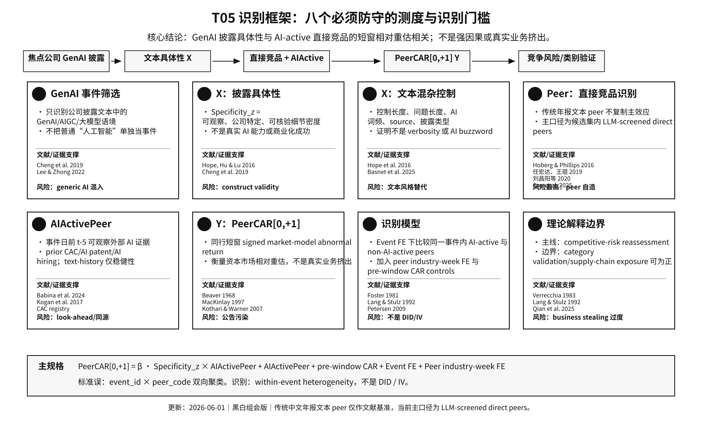

# T05 组会版实验设计：GenAI 具体化披露与产品市场同行重估

日期：2026-06-01 组会版  
当前定位：capital-market peer revaluation paper，不写强因果，不写真实 business stealing。

新版测度支撑框架图：

```text
docs/design/13_framework_measurement_support_20260601.md
docs/design/figures/figure_framework_measurement_support_20260601.svg
docs/design/figures/figure_framework_measurement_support_20260601.png
```



## 1. 一句话研究问题

本文研究：

```text
中国上市公司更具体的 GenAI / 大模型 / AIGC 披露，
是否会使资本市场对已经 AI-active 的近产品市场同行进行更负面的短窗口相对重估？
```

最安全的英文表述：

```text
Do capital markets use concrete GenAI disclosures to reassess AI-active
product-market peers?
```

## 2. 核心故事

GenAI 披露对同行有两种方向相反的市场含义。

第一，**category validation**。如果披露内容主要是算力、供应链、生态合作、行业需求或 AI 产业景气，市场可能把它理解为整个 AI 赛道被验证。此时同行可能不跌，甚至一起上涨。

第二，**competitive-risk revaluation**。如果焦点公司披露了具体产品、模型、应用场景、部署进度、客户方向、合作方或商业化路径，投资者更可能把它理解为焦点公司在产品市场上的可信竞争信号。这个信号最应该影响已经处于 AI 竞争空间、且产品市场接近的同行。

本文的核心结论不应写成：

```text
GenAI disclosure causes rival value destruction.
```

而应写成：

```text
More specific focal GenAI disclosures are associated with more negative
short-window revaluation of AI-active close product-market peers.
```

## 3. 文献锚点与变量测度

### 3.1 X：GenAI 披露具体性

主 X：

```text
Specificity_z_e
```

含义：

```text
焦点公司 GenAI 披露文本中，具体、公司特定、可核验细节的标准化密度。
```

文献锚：

- Hope, Hu and Lu (2016, Review of Accounting Studies)：qualitative disclosure specificity / level of detail。
- Cheng, De Franco, Jiang and Lin (2019, Management Science)：技术热点披露需要区分 generic / speculative talk 与 substantive / existing technology disclosure。

本文迁移：

```text
Specificity_e = concrete GenAI disclosure details_e / GenAI-related text length_e
Specificity_z_e = standardized Specificity_e
```

解释边界：

```text
可以说：披露更具体、更公司特定、更可核验。
不要说：公司真实 GenAI 能力更强、真实投资更多、真实商业化更成功。
```

### 3.2 Y：同行短窗口异常收益

主 Y：

```text
PeerCAR[0,+1]_{j,t}
```

定义：

```text
产品市场同行 j 在焦点公司 GenAI 披露日 t 到下一交易日 t+1 的 market-model CAR。
```

它是 signed CAR，不是 `ln(1+Y)`，也不是 `|CAR|`。

文献锚：

- Beaver (1968), MacKinlay (1997), Kothari and Warner (2007)：事件研究 / abnormal returns。
- Foster (1981), Lang and Stulz (1992)：同行信息转移与竞争效应。

### 3.3 产品市场同行：DeepSeek Flash-selected peers

当前主 peer 口径改为：

```text
DeepSeek Flash-selected Top5 product-market peers
```

构造流程：

1. 先构造 no-random 候选池，每个 focal firm 最多 15 个候选。
2. 候选来自三个可审计来源：
   - CSMAR 主营业务 / 经营范围文本 Top10；
   - 年报业务描述同细行业 Top10；
   - 年报业务描述 AI-word-stripped global Top10。
3. 用 `deepseek-v4-flash` 从候选菜单中选择最多 5 个 direct product-market peers。
4. 输出只保留候选代码 JSON，避免长理由和不可复现文本。
5. 保存候选菜单、API 日志、模型、日期、token 使用量和最终 peer 网络。

文献锚：

- Hoberg and Phillips (2016, Journal of Political Economy)：text-based product-market peer / TNIC 思想。
- Cao, Chen, Tucker and Wan (2025, Review of Accounting Studies)：GenAI-assisted peer-firm identification。

边界：

```text
不能写成完全复制 TNIC；
不能写成完全复制 Cao et al. 的 Bard/GPT peer list；
应写成：
GenAI-assisted product-market peer selection from an auditable candidate menu.
```

DeepSeek 全量编码结果：

```text
focal firms coded: 2,652
selected focal-peer pairs: 11,864
prompt tokens: 2,237,821
completion tokens: 97,058
estimated API cost: about RMB 2.4 under deepseek-v4-flash pricing
```

最终 peer 来源构成：

| 候选来源 | selected pairs |
|---|---:|
| CSMAR scope | 7,158 |
| annual same-industry | 4,585 |
| annual global AI-stripped | 121 |

当前 peer-validity 非人工验证：

```text
output stability, 100-focal rerun:
    mean Jaccard overlap = 0.8708
    median Jaccard overlap = 1.0000
    top1 same share = 84.5%

return comovement, 2025-2026:
    DeepSeek candidate-menu peers:
        abnormal-return beta = 0.6008
        abnormal-return corr = 0.4147
    random same-industry peers:
        beta = 0.4592
        corr = 0.3007
    low-similarity peers:
        beta = 0.3780
        corr = 0.2459

fundamental comovement:
    DeepSeek candidate-menu peers rank first among tested systems
    in gross-margin residual correlation and sales-growth residual correlation.
```

读法：跳过人工专家盲审后，当前最快可用的验证链条是：
输出稳定性、与非随机文本 peer 系统的 overlap、收益共动、基本面共动、
以及 random / low-similarity placebo。它能支持 DeepSeek-selected Top5 是
validated product-market-neighbor proxy，但仍不能写成“真实竞品金标准”。

同一 DeepSeek 候选菜单内的 placebo：

```text
v20 重新构造 placebo：
    先复原 v17 no-random candidate menu；
    排除 DeepSeek Flash-selected Top5；
    再在剩余候选中构造 low-similarity Top5 和 random Top5。

DeepSeek-candidate low-similarity Top5, ext_any:
    coef =  0.000094
    p    = 0.9226

DeepSeek-candidate random Top5, ext_any:
    coef = -0.001639
    p    = 0.1067
```

读法：low-similarity within-candidate placebo 很干净；random within-candidate
placebo 有同方向但不显著，因为候选菜单本身已经包含 plausible peers。
因此 v20 random 是 stress test，不是最强 falsification。最强反驳仍应
来自 low-similarity、旧 same-industry random、non-GenAI pseudo-events、
以及 open-ended v18 不复制 `ext_any` 主结果。

补充诊断：Cao-style open-ended DeepSeek peers

为检验主结果是否依赖候选菜单，另构造更接近 Cao et al. (2025) 的
open-ended LLM peer definition：不向 DeepSeek 提供候选池，只要求其按
2025 年底信息列出每家 focal firm 的 A 股产品市场竞品，并输出股票代码。

结果：

```text
matched focal firms: 2,585 / 2,652
selected peer pairs: 12,099
unmatched generated peers: 1
pair overlap with v17 candidate-menu DeepSeek peers: 11.8%
median focal-level Jaccard overlap with v17: 0.000
```

主回归结果：

```text
Top5, AIActive = ext_any:
    coef = -0.000828
    p    = 0.2228

same-industry filtered open-ended Top5:
    ext_any:              coef = -0.000630, p = 0.4926
    current_text_history: coef = -0.002373, p = 0.0140
    ext_plus_history:     coef = -0.001883, p = 0.0229
```

读法：open-ended Cao-style 版本方向多为负，但在最干净的 external
AIActive (`ext_any`) 下不复制主结果。这说明它应作为 conservative
robustness / boundary check，而不是替代主 peer definition。主文中必须
透明说明：本文采用的是 Cao-inspired、candidate-menu-constrained、
可审计的 GenAI-assisted peer selection，而不是完全复刻 Cao et al. 的
open-ended Bard peer list。

### 3.4 AI-active peer

主调节变量：

```text
AIActivePeer_{j,t-5} = ext_any
```

定义：

```text
ext_any =
    prior CAC GenAI filing / registration
 OR prior broad-AI patent grant
 OR prior broad-AI hiring in the previous 365 days
```

所有证据必须在焦点披露日前至少 5 天可观察，避免 look-ahead。

稳健性定义：

```text
current_text_history =
    peer firm had prior GenAI disclosure before event date t-5
```

解释边界：

```text
ext_any 是事件前外部 AI 活动证据，不是精确 GenAI 能力。
current_text_history 更贴近 GenAI 叙事历史，但有同源文本和 pretrend 风险。
```

## 4. 主样本

观察单位：

```text
focal GenAI disclosure event e × product-market peer firm j
```

主样本：

```text
每家焦点公司首次 GenAI 披露事件 × DeepSeek Flash-selected Top5 peers
```

主回归有效样本：

```text
N = 7,813
events = 2,311
focal firms = 2,311
peer firms = 3,342
window = 2023-2026
announcement-cleaned = yes
requires PeerCAR[-10,-2] and PeerCAR[-20,-2] = yes
```

## 5. 基准模型

```text
PeerCAR_{e,j,[0,+1]}
  = beta_1 AIActivePeer_{j,t-5}
  + beta_2 Specificity_z_e × AIActivePeer_{j,t-5}
  + theta_1 PeerCAR_{j,[-10,-2]}
  + theta_2 PeerCAR_{j,[-20,-2]}
  + EventFE_e
  + PeerIndustryWeekFE_{j,t}
  + epsilon_{e,j}
```

推断：

```text
Two-way clustered standard errors by event_id and peer_code.
```

核心系数：

```text
beta_2
```

解释：

```text
同一个焦点披露事件内，
AI-active peers 相对 non-AI-active peers 的短窗口 CAR 差异，
是否随着焦点披露 Specificity_z 更高而更负。
```

为什么需要 Event FE：

```text
Event FE 吸收焦点事件层面的全部平均冲击：
焦点公司新闻、披露日市场环境、披露本身平均效应和 Specificity_z 主效应。
```

为什么需要 PeerIndustryWeek FE：

```text
吸收同一周同一同行行业的共同市场波动。
```

为什么需要 pre-window CAR controls：

```text
控制同行事件前估值趋势，尤其是 text-history AIActive 的 pretrend concern。
```

识别边界：

```text
这不是 DID，也不是 IV。
最安全表述是 short-window peer-side market reassessment conditional on focal GenAI disclosure。
```

## 6. 当前主结果

DeepSeek Flash-selected Top5 peers：

| AIActive 定义 | TopN | coef: Specificity_z × AIActive | p-value | N | events |
|---|---:|---:|---:|---:|---:|
| ext_any | Top5 | -0.002137 | 0.0157 | 7,813 | 2,311 |
| current_text_history | Top5 | -0.002283 | 0.0108 | 7,813 | 2,311 |
| ext_plus_history | Top5 | -0.002252 | 0.0116 | 7,813 | 2,311 |
| ext_any | Top3 | -0.002270 | 0.0678 | 4,957 | 2,247 |

经济含义：

```text
焦点披露 Specificity_z 增加 1 个标准差时，
AI-active Top5 产品市场同行相对 non-AI-active 同行的两日 abnormal return
低约 21 bps。
```

与旧 CSMAR scope 结果相比：

```text
旧 CSMAR scope Top5 ext_any:
    coef about -0.0021, p about 0.02

DeepSeek Flash Top5 ext_any:
    coef = -0.002137, p = 0.0157
```

解释：

```text
DeepSeek peer selection 没有削弱主结果，反而保留了与旧 CSMAR scope
几乎同量级的负向同行重估。
```

## 7. 关键对照与风险

### 7.1 年报-only peer 不支持主效应

纯年报业务文本 peer 替换后，主效应没有复制：

```text
annual only Top5 ext_any:
    coef = 0.000025, p = 0.982
```

这说明：

```text
主结果不是所有文本 peer 网络都会出现；
结果依赖更贴近上市公司业务范围 / 主营描述的候选系统。
```

组会上应主动承认：

```text
peer definition 是最大风险点。
```

### 7.2 patent peer / analyst peer 不支持主效应

替代 peer 系统结果：

```text
patent_fine_ipc_lagged Top5 ext_any:
    coef = +0.000980, p = 0.387

common_analyst_lagged Top5 ext_any:
    coef = -0.001315, p = 0.381
```

解释：

```text
本文不是技术邻近 peer，也不是信息关注邻近 peer。
主线必须限定为 product-market peer revaluation。
```

### 7.3 数据处理敏感性

旧 CSMAR / semantic 系列结果显示：

```text
winsorized Y 仍成立；
drop ST-like names 仍成立；
same-industry-only 仍成立；
drop any focal/peer announcement 后边际；
trim 2.5%-97.5% 后会明显变弱。
```

解释：

```text
结果不是纯粹由少数极端值驱动，
但它依赖 announcement cleaning + [0,+1] window + close-peer definition。
```

## 8. 假设

### H1：条件性同行重估

更具体的焦点 GenAI 披露，与 AI-active 的 DeepSeek-selected Top5 产品市场同行更负的 `PeerCAR[0,+1]` 相关。

### H2：产品市场近邻性

负向重估应主要出现在 close product-market peers 中，而不是纯年报同行、专利技术同行、共同分析师同行或随机同行中。

### H3：外部 AI 活动证据

结果不应只依赖历史披露文本定义的 AIActive。用事件前外部 AI 活动证据 `ext_any` 定义 AIActive，也应得到同方向结果。

### H4：category validation boundary

AI 供应链、算力、生态、行业需求类披露不应产生同样的 AI-active close-peer 负向重估；它们更可能对应 category validation。

## 9. 建议主表结构

### Table 1：样本与变量

- event-level GenAI disclosure sample；
- DeepSeek peer network construction；
- `Specificity_z`、`ext_any`、`PeerCAR[0,+1]` summary。

### Table 2：主回归

Headline：

```text
DeepSeek Flash Top5 peers
AIActive = ext_any
event FE + peer industry-week FE
pre-window CAR controls
two-way clustering
```

并列列：

```text
Top3 / Top5
ext_any / current_text_history / ext_plus_history
```

### Table 3：peer definition 对照

```text
DeepSeek Flash Top5
deterministic semantic no-random Top5
old CSMAR scope Top5
annual-only Top5
patent peer Top5
common-analyst peer Top5
```

目的：证明主结果确实是 product-market peer story，而不是所有 peer 网络都显著。

### Table 4：peer validity

```text
output stability rerun
overlap with CSMAR / annual / AI-stripped peer systems
return comovement
fundamental comovement
DeepSeek selected source mix
random / low-similarity placebo contrast
DeepSeek-candidate-menu placebo contrast
```

### Table 5：cleaning and timing

```text
announcement cleaning
drop ST-like names
winsor / trim
CAR[0,+1], CAR[-1,+1], AR[0]
pre-window controls
```

### Table 6：boundary

```text
supply-chain / infrastructure / category-validation disclosure
focal good-news control
non-GenAI pseudo events
```

## 10. 组会上可说与不可说

可以说：

```text
我们现在有一版 GenAI-assisted peer selection。
DeepSeek Flash 从可审计候选菜单中选择 Top5 产品市场同行，
主效应在 ext_any 下显著，系数约 -21 bps。
```

可以说：

```text
结果更适合解释为资本市场对竞争风险的短窗相对重估，
而不是强因果或真实业务挤出。
```

必须主动说：

```text
peer definition 是最大风险。
纯年报 peer、专利 peer、共同分析师 peer 都没有复制主效应。
因此本文的贡献必须限定在 product-market peer revaluation，
并用 DeepSeek-selected peers + validity gates 来防守。
```

不要说：

```text
GenAI 披露导致竞争对手价值损失。
Specificity_z 代表真实 AI 能力。
DeepSeek peers 完全等同于 TNIC 或完全复刻 Cao et al.。
年报 peer 也支持主结果。
```

## 11. 组会后下一步

1. 用 DeepSeek Flash peer network 重跑完整 placebo battery：
   - low-similarity / random placebo；
   - DeepSeek-candidate-menu low-similarity / random placebo；
   - non-GenAI pseudo-events；
   - AI-word-stripped candidate robustness；
   - focal CAR and focal CAR × AIActive controls。
2. 生成 DeepSeek peer validity 表：
   - output stability rerun；
   - return comovement；
   - sales-growth / gross-margin comovement；
   - selected-source mix；
   - 与 CSMAR / annual / deterministic semantic peer 的 overlap。
3. 把 API prompt、模型、日期、候选菜单、输出格式、token 用量写进 measurement appendix。
4. 冻结主表：
   - `Specificity_z × ext_any`;
   - `PeerCAR[0,+1]`;
   - DeepSeek Flash Top5;
   - first focal GenAI events;
   - event FE + peer industry-week FE + pre-window controls;
   - two-way clustering.

## 12. 当前 go / no-go 判断

```text
Go, but conservative.
```

理由：

```text
X 有 Hope-style disclosure specificity 文献锚；
Y 是标准短窗 abnormal return；
peer 已从旧 CSMAR Top5 升级为 DeepSeek-assisted Top5；
主结果在 ext_any 下保留；
理论故事能讲成 category validation vs competitive-risk revaluation。
```

剩余硬伤：

```text
peer definition sensitivity；
Specificity_z construct validity 仍需谨慎；
不是强外生识别；
不能写 realized competition。
```
