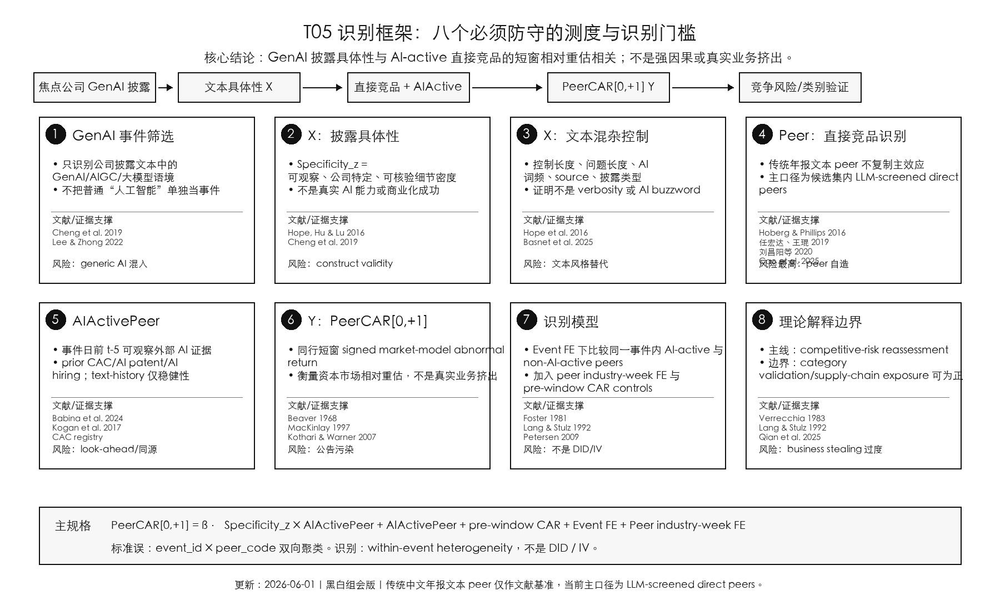

# T05 当前框架图与测度支撑

日期：2026-06-01

用途：组会讨论版。本文现在最需要防守的是“每一个关键变量是不是有文献或数据测度支撑”。本文件把理论路径、X/Y 测度、peer 识别和调节变量的支撑统一到一张图和一张表里。


PNG 预览：



## 1. 核心研究问题

```text
更具体的焦点公司 GenAI 披露，
是否与 AI-active 近产品市场同行更负的短窗口市场重估相关？
```

最安全定位：

```text
capital-market peer revaluation paper
```

不要写成：

```text
strong causal paper
realized business-stealing paper
real GenAI capability paper
```

## 2. X/Y 与关键测度支撑

| 模块 | 变量 / 测度 | 当前操作化 | 文献 / 数据支撑 | 本文解释边界 |
|---|---|---|---|---|
| 事件筛选 | `GenAI disclosure event` | 焦点公司首次出现 GenAI / AIGC / 大模型 / LLM / ChatGPT / 命名模型等披露事件；来源包括互动平台、IR、公告文本 | Cheng, De Franco, Jiang and Lin (2019, *Management Science*) 的技术热潮披露事件逻辑；Lee and Zhong (2022, *JAE*) 的中国投资者互动平台披露环境 | 这是事件筛选，不直接等于真实 GenAI 投资 |
| 主 X | `Specificity_z` | GenAI 相关文本中具体、公司特定、可核验细节密度的标准化值；包括产品/模型/平台名、合作方、客户、应用场景、部署进度、日期、金额、数量等 | Hope, Hu and Lu (2016, *Review of Accounting Studies*) 的 disclosure specificity / level of detail；Cheng et al. (2019) 支撑技术披露要区分 generic/speculative 与 substantive/existing | 测的是投资者可观察文本具体性，不是真实 AI 能力 |
| 同行网络 | DeepSeek Flash-selected Top5 product-market peers | 先从 CSMAR 经营范围、年报同业业务文本、年报 AI-word-stripped global 文本构造可审计候选池；再由 DeepSeek Flash 选择 Top5 direct product-market peers | Hoberg and Phillips (2016, *JPE*) 的 text-based product-market peer / TNIC 思想；Cao, Chen, Tucker and Wan (2025, *RAST*) 的 GenAI-assisted peer identification | 这是 Cao-inspired 中国 A 股适配版，不是完全复刻 TNIC 或 Cao open-ended Bard list |
| peer validity | 输出稳定性 / 共动 / placebo | 100-focal 复跑稳定性；与 CSMAR/年报文本 peer overlap；收益共动；销售增长和毛利率共动；candidate-menu low-sim/random placebo | Cao et al. (2025) 的 peer validation 思路：output stability、专家/替代系统收敛、return/fundamental relatedness；本文用可迁移的非人工验证项 | 通过“可防守 proxy”验证，但不是专家确认的真实竞品金标准 |
| 调节变量 | `AIActivePeer = ext_any` | peer 在事件日前至少 5 天已有任一外部 AI 活动证据：CAC 生成式 AI 备案 / broad-AI patent grant / broad-AI hiring in prior 365 days | Babina et al. (2024, *JFE*) 支撑 AI hiring 作为 firm-level AI investment / human-capital signal；Kogan et al. (2017, *QJE*) 支撑 patent-based innovation evidence；CAC 备案是公开监管可观察证据 | 这是事前 AI positioning，不是精确 GenAI capability |
| 主 Y | `PeerCAR[0,+1]` | 产品市场同行在焦点披露日 0 到下一交易日 +1 的 signed market-model cumulative abnormal return | Beaver (1968, *JAR*)、MacKinlay (1997)、Kothari and Warner (2007) 的事件研究异常收益框架；Foster (1981) 与 Lang and Stulz (1992, *JFE*) 的同行信息转移 / 竞争效应 | 测的是短窗口资本市场相对重估，不是真实业务挤出 |
| 控制与识别 | pre-window CAR、event FE、peer industry-week FE、two-way clustering | 控制 `PeerCAR[-10,-2]`、`PeerCAR[-20,-2]`；加入焦点事件固定效应和同行行业-周固定效应；按 event 和 peer firm 双向聚类 | 事件研究和同行溢出文献的标准清洁窗口和聚类推断逻辑；Petersen (2009, *RFS*) 可作为双向聚类推断支撑 | 识别是 within-event heterogeneity，不是 DID / IV |

## 3. 当前主模型

```text
PeerCAR[0,+1]_{e,j}
  = β · Specificity_z_e × AIActivePeer_{j,t-5}
  + θ · AIActivePeer_{j,t-5}
  + λ1 · PeerCAR[-10,-2]_{j,t}
  + λ2 · PeerCAR[-20,-2]_{j,t}
  + Event FE_e
  + Peer industry-week FE_{j,t}
  + ε_{e,j}
```

核心解释：

```text
同一焦点披露事件内，
AI-active peers 相对 non-AI-active peers 的短窗口 CAR 差异，
是否随着焦点披露 Specificity_z 更高而更负。
```

## 4. 当前框架图的读法

1. `Specificity_z` 是文本信号，不是能力。
2. `PeerCAR[0,+1]` 是市场重估，不是真实竞争结果。
3. DeepSeek Top5 peer 是 Hoberg-Phillips 文本产品市场 peer 思想和 Cao et al. GenAI-assisted peer identification 的中国 A 股适配版。
4. `ext_any` 是事件前外部 AI positioning，用于识别哪些同行更容易被投资者拿来横向比较。
5. 理论上存在两条方向相反的解释：
   - 行业验证效应：同行 0 或正向；
   - 竞争风险重估：AI-active close peers 更负。
6. 本文主效应只支持第二条路径的条件性证据，不支持强因果或真实 business stealing。

## 5. 组会最安全表述

```text
本文参考 Hope et al. (2016) 构造生成式 AI 披露具体性，
参考 Hoberg and Phillips (2016) 与 Cao et al. (2025)
构造并验证 GenAI-assisted product-market peer network，
用标准事件研究中的 signed PeerCAR[0,+1] 衡量同行短窗口市场重估。

结果应解释为：
更具体的 GenAI 披露与 AI-active 近产品市场同行更负的短窗口相对重估相关。
```

